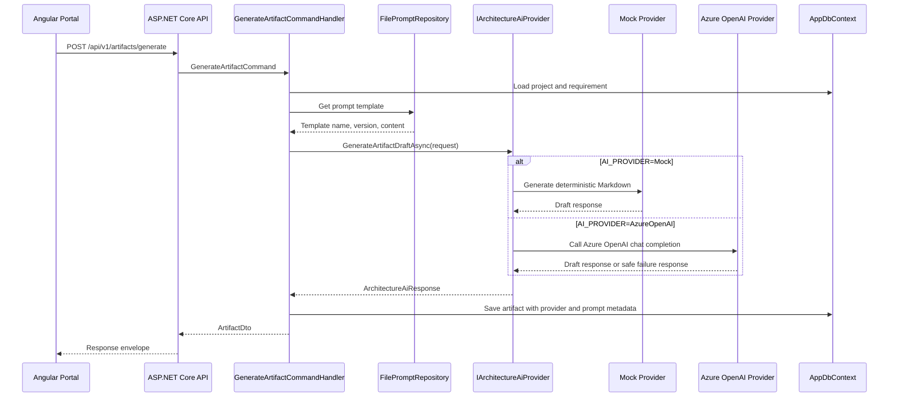

# AI Provider Abstraction Sequence

```mermaid
sequenceDiagram
    participant UI as Angular Portal
    participant API as ASP.NET Core API
    participant Handler as GenerateArtifactCommandHandler
    participant Prompts as FilePromptRepository
    participant Provider as IArchitectureAiProvider
    participant Mock as Mock Provider
    participant Azure as Azure OpenAI Provider
    participant DB as AppDbContext

    UI->>API: POST /api/v1/artifacts/generate
    API->>Handler: GenerateArtifactCommand
    Handler->>DB: Load project and requirement
    Handler->>Prompts: Get prompt template
    Prompts-->>Handler: Template name, version, content
    Handler->>Provider: GenerateArtifactDraftAsync(request)
    alt AI_PROVIDER=Mock
        Provider->>Mock: Generate deterministic Markdown
        Mock-->>Provider: Draft response
    else AI_PROVIDER=AzureOpenAI
        Provider->>Azure: Call Azure OpenAI chat completion
        Azure-->>Provider: Draft response or safe failure response
    end
    Provider-->>Handler: ArchitectureAiResponse
    Handler->>DB: Save artifact with provider and prompt metadata
    Handler-->>API: ArtifactDto
    API-->>UI: Response envelope
```

The application layer depends on `IArchitectureAiProvider`; local and CI execution do not require Azure OpenAI credentials.
