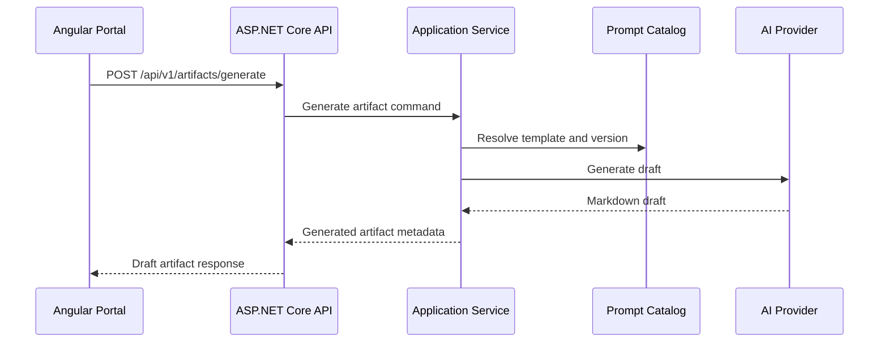

# AI Provider Sequence

```mermaid
sequenceDiagram
    participant Web as Angular Portal
    participant Api as ASP.NET Core API
    participant App as Application Service
    participant Prompt as Prompt Catalog
    participant Provider as AI Provider
    Web->>Api: POST /api/v1/artifacts/generate
    Api->>App: Generate artifact command
    App->>Prompt: Resolve template and version
    App->>Provider: Generate draft
    Provider-->>App: Markdown draft
    App-->>Api: Generated artifact metadata
    Api-->>Web: Draft artifact response
```
