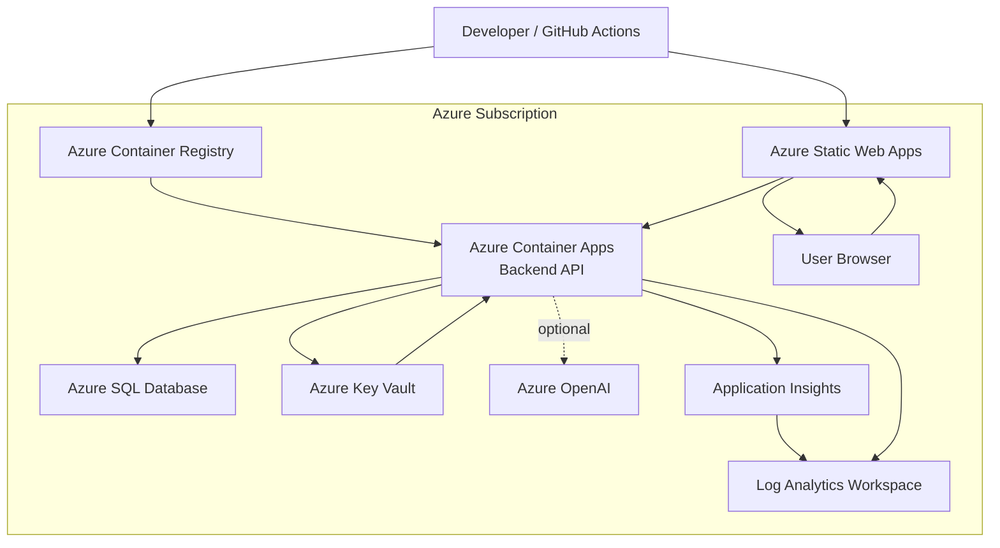

# Azure Deployment Diagram

The Bicep blueprint models the target Azure topology. Production deployment still requires environment-specific networking, identity, security, cost, and compliance review.
