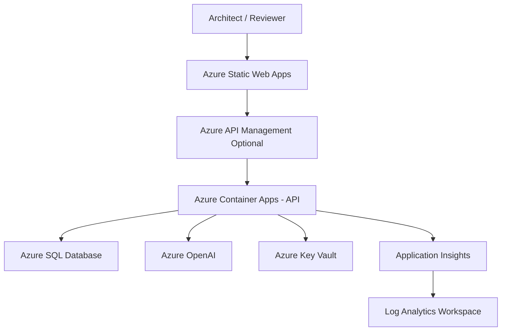

# Azure Deployment Diagram

```mermaid
flowchart TB
    User[Architect / Reviewer] --> SWA[Azure Static Web Apps]
    SWA --> APIM[Azure API Management Optional]
    APIM --> ACA[Azure Container Apps - API]
    ACA --> SQL[Azure SQL Database]
    ACA --> AOAI[Azure OpenAI]
    ACA --> KV[Azure Key Vault]
    ACA --> AI[Application Insights]
    AI --> LAW[Log Analytics Workspace]
```
