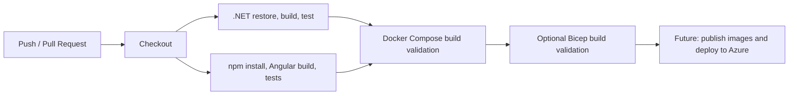

# CI/CD Pipeline Diagram

The current CI validates backend, frontend, and Docker build readiness. Azure deployment workflows are intentionally blueprint-oriented and require environment secrets before use.
