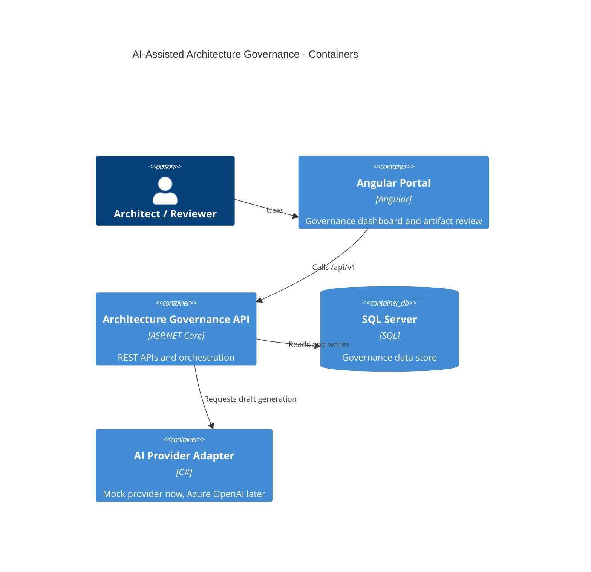

# Container Diagram

```mermaid
C4Container
title AI-Assisted Architecture Governance - Containers
Person(user, "Architect / Reviewer")
Container(web, "Angular Portal", "Angular", "Governance dashboard and artifact review")
Container(api, "Architecture Governance API", "ASP.NET Core", "REST APIs and orchestration")
ContainerDb(db, "SQL Server", "SQL", "Governance data store")
Container(ai, "AI Provider Adapter", "C#", "Mock provider now, Azure OpenAI later")
Rel(user, web, "Uses")
Rel(web, api, "Calls /api/v1")
Rel(api, db, "Reads and writes")
Rel(api, ai, "Requests draft generation")
```
