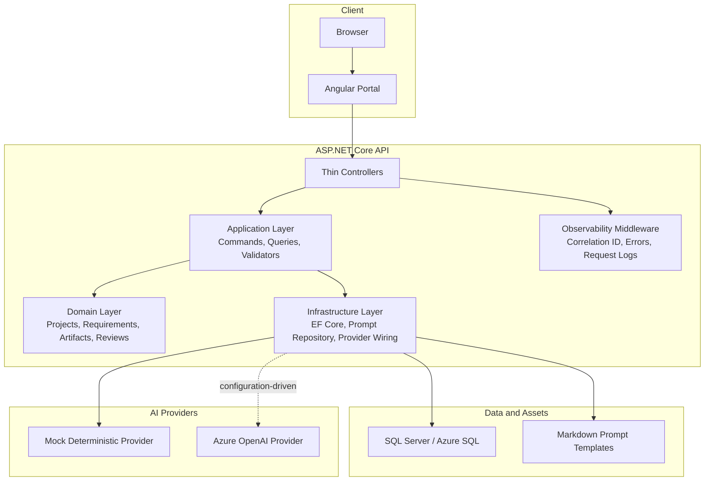

# Container Diagram

The API preserves layered boundaries. Controllers coordinate HTTP concerns, the application layer owns use cases, the domain layer owns governance concepts, and infrastructure owns persistence, prompt loading, and AI provider adapters.
