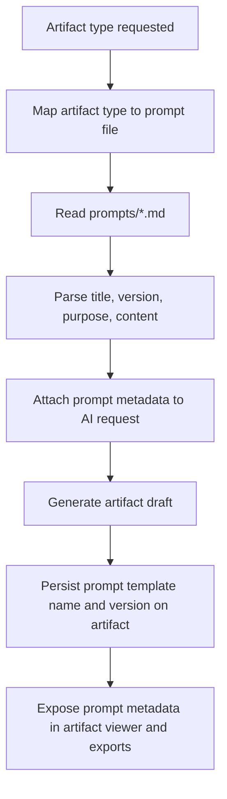

# Prompt Template Loading Flow

```mermaid
flowchart TD
    A["Artifact type requested"] --> B["Map artifact type to prompt file"]
    B --> C["Read prompts/*.md"]
    C --> D["Parse title, version, purpose, content"]
    D --> E["Attach prompt metadata to AI request"]
    E --> F["Generate artifact draft"]
    F --> G["Persist prompt template name and version on artifact"]
    G --> H["Expose prompt metadata in artifact viewer and exports"]
```

Prompt templates are source-controlled architecture assets. Generated artifacts retain the prompt name and version used for traceability.
