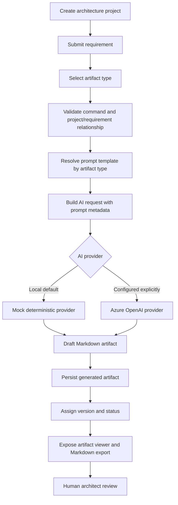

# Requirement-to-Artifact Generation Flow

```mermaid
flowchart TD
    A["Create architecture project"] --> B["Submit requirement"]
    B --> C["Select artifact type"]
    C --> D["Validate command and project/requirement relationship"]
    D --> E["Resolve prompt template by artifact type"]
    E --> F["Build AI request with prompt metadata"]
    F --> G{"AI provider"}
    G -->|Local default| H["Mock deterministic provider"]
    G -->|Configured explicitly| I["Azure OpenAI provider"]
    H --> J["Draft Markdown artifact"]
    I --> J
    J --> K["Persist generated artifact"]
    K --> L["Assign version and status"]
    L --> M["Expose artifact viewer and Markdown export"]
    M --> N["Human architect review"]
```

Every generated artifact is traceable to a project, requirement submission, prompt template, prompt version, provider, and correlation ID.
