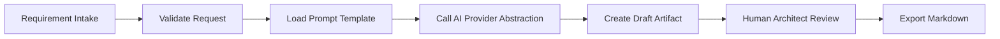

# Requirement to Artifact Flow

```mermaid
flowchart LR
    A[Requirement Intake] --> B[Validate Request]
    B --> C[Load Prompt Template]
    C --> D[Call AI Provider Abstraction]
    D --> E[Create Draft Artifact]
    E --> F[Human Architect Review]
    F --> G[Export Markdown]
```
