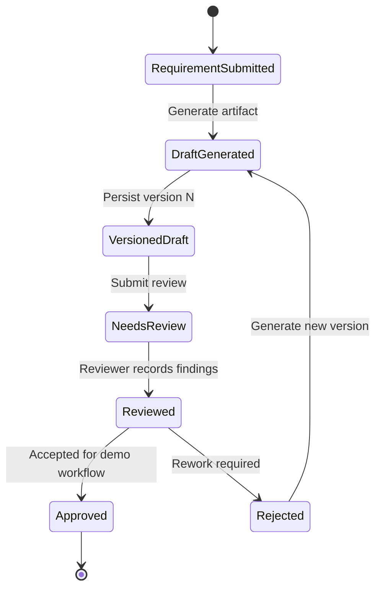

# Human Review and Artifact Versioning Flow

```mermaid
stateDiagram-v2
    [*] --> RequirementSubmitted
    RequirementSubmitted --> DraftGenerated: Generate artifact
    DraftGenerated --> VersionedDraft: Persist version N
    VersionedDraft --> NeedsReview: Submit review
    NeedsReview --> Reviewed: Reviewer records findings
    Reviewed --> Approved: Accepted for demo workflow
    Reviewed --> Rejected: Rework required
    Rejected --> DraftGenerated: Generate new version
    Approved --> [*]
```

Review status captures human workflow state. It does not imply production approval outside the documented demo governance process.
