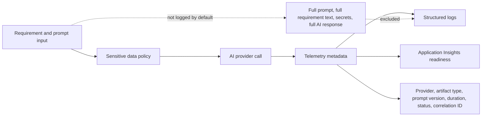

# Safe AI Telemetry Flow

```mermaid
flowchart LR
    Request["Requirement and prompt input"] --> Policy["Sensitive data policy"]
    Policy --> Provider["AI provider call"]
    Provider --> Metadata["Telemetry metadata"]
    Metadata --> Logs["Structured logs"]
    Metadata --> AppInsights["Application Insights readiness"]

    Request -. not logged by default .-> Blocked["Full prompt, full requirement text, secrets, full AI response"]
    Blocked -. excluded .-> Logs

    Metadata --> Fields["Provider, artifact type, prompt version, duration, status, correlation ID"]
```

The platform logs operational metadata for supportability while avoiding full confidential inputs, prompts, responses, keys, tokens, and connection strings.
