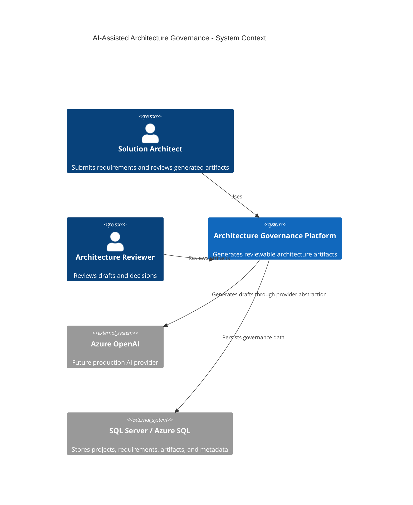

# System Context Diagram

```mermaid
C4Context
title AI-Assisted Architecture Governance - System Context
Person(architect, "Solution Architect", "Submits requirements and reviews generated artifacts")
Person(reviewer, "Architecture Reviewer", "Reviews drafts and decisions")
System(platform, "Architecture Governance Platform", "Generates reviewable architecture artifacts")
System_Ext(azureOpenAi, "Azure OpenAI", "Future production AI provider")
System_Ext(sql, "SQL Server / Azure SQL", "Stores projects, requirements, artifacts, and metadata")
Rel(architect, platform, "Uses")
Rel(reviewer, platform, "Reviews artifacts")
Rel(platform, azureOpenAi, "Generates drafts through provider abstraction")
Rel(platform, sql, "Persists governance data")
```
