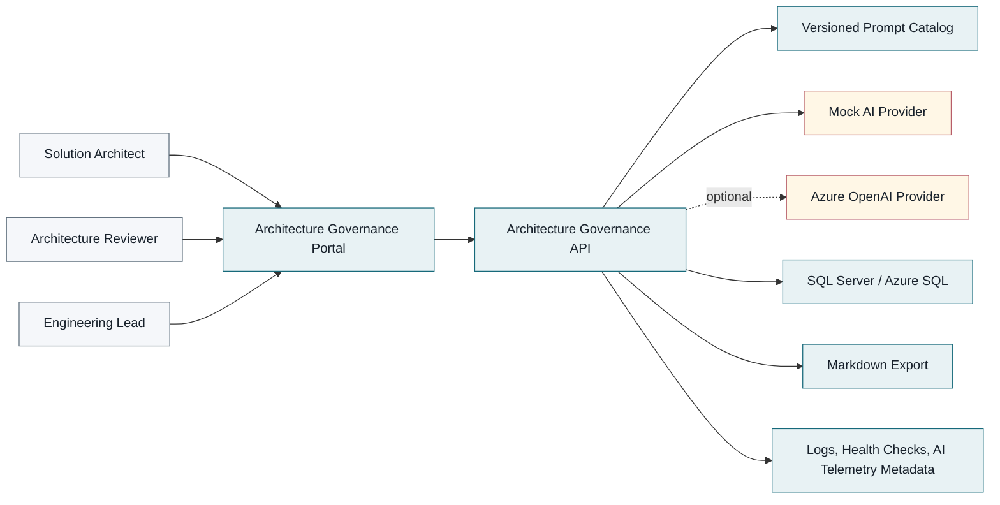

# System Context Diagram

The platform sits between architecture stakeholders and AI providers. It turns requirements into governed draft artifacts while preserving prompt versioning, traceability, review status, and safe telemetry boundaries.
